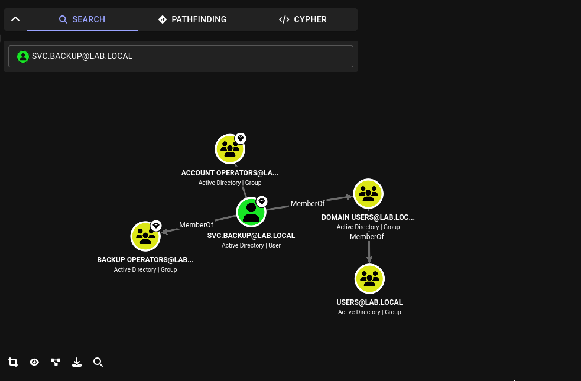

# Kapitel 4: Active Directory Attacks

Ausgangspunkt dieses Kapitels war die Frage, wie ein Angreifer vorgeht, der sich bereits im internen Netzwerk befindet, aber noch keine Domain-Credentials besitzt. Der Windows Server 2022 wurde zuvor als Domain Controller (`dc01.lab.local`) für die Domäne `lab.local` aufgesetzt, inklusive mehrerer Testuser und eines Service-Accounts (`svc.backup`) mit absichtlich schwacher Konfiguration.

## Theorie: Warum Active Directory ein Hauptangriffsziel ist

In den meisten Unternehmensnetzwerken ist Active Directory die zentrale Instanz für Authentifizierung und Autorisierung. Wer die Domäne kontrolliert, kontrolliert praktisch jedes Windows-System im Netzwerk. Aus Angreifersicht ist AD deshalb selten das erste Ziel, aber fast immer das wertvollste: Ein initial kompromittierter Low-Privilege-Account ist oft nur der erste Schritt einer Kette, die über Gruppenmitgliedschaften, vererbte Rechte und über Jahre gewachsene Fehlkonfigurationen bis zu Domain Admin führt.

## Schritt 1: Netzwerk-Enumeration ohne Credentials

Erster Schritt war ein vollständiger Netzwerk-Scan, um zu sehen welche Dienste und Hosts überhaupt erreichbar sind:

```bash
nmap -sV -p- -O 192.168.10.40
```

Da ein vollständiger Portscan mit Service- und OS-Detection sehr lange dauert, wurde zusätzlich ein schneller Discovery-Scan über den IP-Bereich gefahren:

```bash
nmap -sn 192.168.10.0/24
```

**Ergebnis auf dem Domain Controller (`.40`):**

| Port | Dienst | Relevanz |
|---|---|---|
| 53 | domain (DNS) | AD-integrierte DNS-Zone — potenzielles Ziel für DNS-Spoofing |
| 88 | kerberos-sec | Kerberos-Authentifizierung — Basis für Kerberoasting |
| 135 | msrpc | RPC-Endpoint-Mapper |
| 139/445 | netbios-ssn / microsoft-ds | SMB — zeigt Signing-Status und SMBv1-Status |
| 389/636 | ldap / ldaps | Verzeichnisdienst-Abfragen |
| 464 | kpasswd5 | Kerberos-Passwortänderung |
| 593 | ncacn_http | RPC über HTTP |
| 3268/3269 | globalcatalog / globalcatalogssl | AD Global Catalog |
| 5357 | wsdapi | Web Services for Devices |
| 5985 | wsman | WinRM — relevant für spätere Remote-Shells |

**Wichtige Beobachtung:** Port 445 wurde von nmap nur als `microsoft-ds` angezeigt, nicht explizit als "SMB". Das ist normales nmap-Verhalten — der Dienst dahinter ist trotzdem SMB.

## Schritt 2: SMB-Enumeration ohne Anmeldedaten

Mit CrackMapExec lässt sich gegen SMB enumerieren, ohne gültige Credentials zu besitzen:

```bash
crackmapexec smb 192.168.10.40
```

**Ergebnis:** Server-Name, Server-Version, Domain-Name, `signing: True`, `SMBv1: False`.

**Bewertung:**
- `signing: True` bedeutet, dass jede SMB-Kommunikation kryptographisch signiert werden muss. Das verhindert NTLM-Relay-Angriffe, bei denen ein Angreifer eine abgefangene Authentifizierung an ein anderes System weiterleitet.
- `SMBv1: False` bedeutet, das veraltete und verwundbare SMBv1-Protokoll (bekannt durch EternalBlue/WannaCry) ist deaktiviert und bietet keine Angriffsfläche.

Beide Werte zeigen eine sauber gehärtete Standard-Konfiguration von Windows Server 2022 — kein einfacher Weg über SMB.

## Schritt 3: AS-REP Roasting (Versuch ohne Credentials)

Bevor Kerberoasting (das gültige Credentials voraussetzt) zum Einsatz kam, wurde realistisch zunächst geprüft, ob ein Angriff **ganz ohne** Zugangsdaten möglich ist. AS-REP Roasting funktioniert gegen Accounts, bei denen die Kerberos-Vorauthentifizierung deaktiviert ist:

```bash
impacket-GetNPUsers lab.local/ -dc-ip 192.168.10.40 -no-pass -usersfile users.txt
```

**Ergebnis:** Kein verwundbarer Account gefunden — alle Domain-User hatten Pre-Authentication korrekt aktiviert. Das ist der Normalzustand und zeigt, dass diese spezifische Schwachstelle in der Lab-Domäne nicht vorlag.

## Schritt 4: Kerberoasting

Mit den zuvor erbeuteten Credentials eines regulären Users (`john.smith`) wurde nach Accounts mit Service Principal Name (SPN) gesucht. Jeder Account mit SPN kann von **jedem** authentifizierten Domain-User per Kerberos-Ticket angefragt werden — unabhängig von dessen eigenen Rechten:

```bash
impacket-GetUserSPNs lab.local/john.smith:Password123! -dc-ip 192.168.10.40
```

**Ergebnis:** Der Service-Account `svc.backup` besitzt eine SPN (`MSSQLSvc/dc01.lab.local:1433`).

**Warum das funktioniert:** Der Domain Controller stellt das angeforderte Ticket Granting Service (TGS) Ticket aus und verschlüsselt es mit dem NTLM-Hash des Passworts des SPN-Accounts — nicht mit dem Hash des anfragenden Users. Jeder Domain-User kann also ein Ticket anfordern, das effektiv mit dem Passwort-Hash eines anderen (potenziell privilegierten) Accounts verschlüsselt ist. Dieses Ticket kann offline geknackt werden, ganz ohne weitere Interaktion mit dem Domain Controller.

```bash
impacket-GetUserSPNs lab.local/john.smith:Password123! -dc-ip 192.168.10.40 -request -outputfile kerberos.txt
```

Der ausgegebene Hash beginnt mit `$krb5tgs$23$*svc.backup$LAB.LOCAL$...` — klassisches Format für Kerberos-TGS-Hashes (RC4/etype 23).

```bash
hashcat -a 0 -m 13100 kerberos.txt /usr/share/wordlists/rockyou.txt
```

**Ergebnis:** Passwort von `svc.backup` erfolgreich geknackt (`Backup2024!`).

**Realistische Einordnung:** Das Passwort war absichtlich schwach konfiguriert (deaktivierte Passwort-Komplexitätsanforderungen in der Default Domain Policy), um den Angriff im Lab nachvollziehbar zu machen. In der Praxis hängt der Erfolg von Kerberoasting direkt von der Passwortstärke des Service-Accounts ab — Service-Accounts werden in Unternehmen erfahrungsgemäß seltener rotiert und oft mit schwächeren, selten geänderten Passwörtern konfiguriert, weil sie "nur" von Diensten und nicht von Menschen genutzt werden.

## Schritt 5: Zugriff via Evil-WinRM

Mit dem geknackten Passwort wurde WinRM (Port 5985, siehe Netzwerk-Scan) für eine Remote-Shell genutzt:

```bash
evil-winrm -i 192.168.10.40 -u svc.backup -p 'Backup2024!'
```

**Voraussetzung:** Der Account musste zunächst zur Gruppe `Remote Management Users` hinzugefügt werden (`Add-ADGroupMember -Identity "Remote Management Users" -Members "svc.backup"`), sonst schlägt die Authentifizierung trotz korrektem Passwort mit einem Autorisierungsfehler fehl — ein Unterschied zwischen *Authentifizierung* (Identität nachweisen) und *Autorisierung* (Berechtigung für diese Aktion haben).

**Einordnung:** Mit bekanntem Klartext-Passwort ist eine Remote-Shell wenig überraschend. Der eigentliche Wert des Angriffs liegt nicht im finalen Login, sondern darin, dass das Passwort überhaupt ohne vorherige Kenntnis extrahiert werden konnte — in einem realen Assessment wäre das Passwort zu Beginn unbekannt gewesen.

## Schritt 6: BloodHound — Active-Directory-Angriffspfade visualisieren

Einzelne Fakten (ein SPN hier, eine Gruppenmitgliedschaft dort) ergeben für einen Menschen kein Gesamtbild. BloodHound sammelt alle AD-Objekte, Rechte und Beziehungen und stellt sie als Graphen dar — damit werden mehrstufige Angriffspfade sichtbar, die manuell kaum zu finden wären.

**Datensammlung** (mit den bereits bekannten Credentials von `john.smith`, keine administrativen Rechte nötig):

```bash
bloodhound-python -c ALL -d lab.local -u john.smith -p 'Password123!'
```

Die Sammlung lieferte 1 Domain, 2 Computer und 7 User als JSON-Dateien.

**Setup-Hürden (Lerneffekt):**
- `bloodhound-python` (der Collector) und `bloodhound` (die GUI) sind zwei vollständig getrennte Tools, die leicht verwechselt werden.
- BloodHound Community Edition läuft als Hintergrunddienst (`systemctl start bloodhound`) und benötigt PostgreSQL statt der klassischen Neo4j-Datenbank der Legacy-Version — ein Authentifizierungsfehler zwischen BloodHound und der Datenbank (`journalctl -u bloodhound`) führte direkt auf die Ursache: unterschiedliche Passwörter in der Service-Konfiguration und der Datenbank selbst.
- DNS-Auflösung des Domain Controllers über den expliziten `-dc`-Parameter schlug fehl; der Collector funktionierte erst nach Entfernen dieses Parameters und Setzen des DC als Nameserver (`/etc/resolv.conf`).

Die gesammelten JSON-Dateien wurden anschließend über die BloodHound-Weboberfläche hochgeladen (Upload-Funktion im Hauptmenü).


### Privilege-Eskalation sichtbar machen

Um den Wert von BloodHound für reale Umgebungen zu demonstrieren, wurde die Ausgangssituation bewusst verschärft: `svc.backup` wurde nacheinander zu zwei Gruppen hinzugefügt, die in echten Unternehmen häufig unbedacht vergeben werden:

```powershell
Add-ADGroupMember -Identity "Account Operators" -Members "svc.backup"
Add-ADGroupMember -Identity "Backup Operators" -Members "svc.backup"
```

**Account Operators:** Kann andere User- und Gruppenobjekte verwalten — aber absichtlich **nicht** privilegierte Gruppen wie Domain Admins oder Administrators. Diese Einschränkung ist von Microsoft bewusst eingebaut, um genau diesen naheliegenden Eskalationsweg zu verhindern.

**Backup Operators:** Kann sämtliche Dateien auf einem Server lesen und schreiben — auch Dateien, die normalerweise durch Berechtigungen geschützt sind, da Backup-Software grundsätzlich uneingeschränkten Lesezugriff benötigt. Auf einem Domain Controller liegt die Datei `NTDS.dit`, welche die Passwort-Hashes **aller** Domain-Accounts enthält, inklusive Domain Admins. Wer Backup-Rechte besitzt, kann diese Datei kopieren und offline alle Hashes extrahieren.

Nach erneutem Sammeln (`bloodhound-python`) und erneutem Upload zeigte der Graph beide neuen Gruppenmitgliedschaften von `svc.backup`.



**Wichtiger methodischer Lerneffekt:** Die direkte Pathfinding-Abfrage von `svc.backup` zu `Domain Admins` zeigte trotzdem **"Path not found"**. BloodHound modelliert ausschließlich AD-Berechtigungsbeziehungen (z.B. `GenericAll`, `WriteDACL`, `ForceChangePassword`, Gruppenmitgliedschaften) als Kanten im Graphen. Der Backup-Operators-Angriffsweg über `NTDS.dit` ist dagegen ein Rechte-Missbrauch auf Dateisystemebene (vergleichbar mit einem DCSync-Angriff) und wird von BloodHound nicht automatisch als Pfad dargestellt, obwohl er in der Praxis genauso zu vollständiger Domain-Kompromittierung führt. BloodHound ist ein sehr mächtiges Werkzeug, ersetzt aber nicht das Verständnis, welche Windows-Rechte faktisch was ermöglichen.

## Der vollständige Angriffspfad

```
nmap-Scan (Ports, Dienste) → kein direkter Einstieg über SMB (Signing aktiv, SMBv1 deaktiviert)
→ AS-REP Roasting ohne Credentials → kein verwundbarer Account
→ Kerberoasting mit john.smith-Credentials → SPN-Account svc.backup identifiziert
→ TGS-Ticket angefordert und offline mit hashcat geknackt → Backup2024!
→ Evil-WinRM Remote-Shell als svc.backup
→ BloodHound-Collection → vollständige AD-Struktur sichtbar
→ svc.backup zu Account Operators + Backup Operators hinzugefügt (simulierte Fehlkonfiguration)
→ Backup-Rechte ermöglichen theoretischen Zugriff auf NTDS.dit → alle Passwort-Hashes der Domäne
```

## Warum SOC-Teams BloodHound ebenfalls nutzen

BloodHound wird in der Praxis von **beiden Seiten** eingesetzt. Red Teams nutzen es, um Angriffspfade zu finden, die ein Mensch durch manuelles Durchsuchen der AD-Struktur kaum entdecken würde. Blue Teams und SOC-Teams setzen es präventiv ein, um die eigene Umgebung zu auditieren: "Welche unprivilegierten Accounts haben über Gruppenmitgliedschaften und vererbte Rechte einen Pfad zu Domain Admin?" Microsoft bietet mit Defender for Identity ein kommerzielles Produkt, das im Kern dieselbe Pfadanalyse kontinuierlich automatisiert durchführt.

## Mitigation

| Schwachstelle | Gegenmaßnahme |
|---|---|
| Kerberoasting (SPN-Accounts mit schwachem Passwort) | Lange, zufällige Passwörter (25+ Zeichen) für Service-Accounts; Group Managed Service Accounts (gMSA) verwenden, deren Passwort automatisch rotiert und nie manuell bekannt ist |
| Fehlende Passwort-Komplexität (Default Domain Policy) | Fine-Grained Password Policies mit Mindestlänge und Komplexitätsanforderungen, besonders für privilegierte und Service-Accounts |
| Unkontrollierte Gruppenmitgliedschaften (Account/Backup Operators) | Regelmäßige Audits privilegierter Gruppen; Prinzip der minimalen Rechtevergabe; BloodHound/Defender for Identity zur kontinuierlichen Pfadanalyse der eigenen Umgebung einsetzen |
| NTDS.dit-Zugriff über Backup-Rechte | Backup Operators nur an dedizierte, überwachte Service-Accounts vergeben, nie an reguläre oder gemeinsam genutzte Accounts; NTDS.dit-Zugriffe protokollieren und alarmieren (z.B. über SIEM) |
| AS-REP Roasting | Kerberos-Vorauthentifizierung für alle Accounts aktiviert lassen (Standardeinstellung nicht ohne triftigen Grund deaktivieren) |
