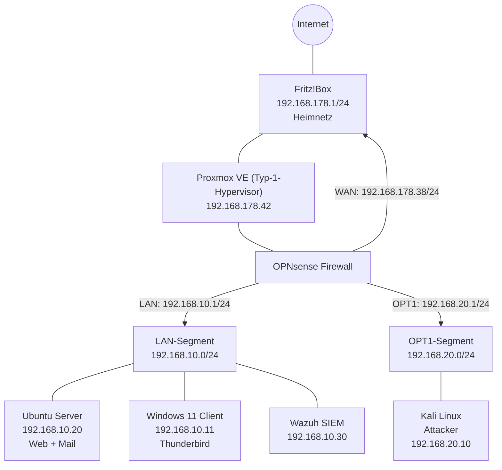

# IT-Security Homelab

Ein isoliertes, segmentiertes Homelab zum praktischen Üben von Penetration Testing, Angriffserkennung (IDS/SIEM) und Netzwerksicherheit — aufgebaut auf eigener Hardware mit Proxmox als Hypervisor.

## Ziel des Projekts

Das Lab bildet eine kleine, aber realistische Unternehmensinfrastruktur nach: eine Firewall mit mehreren Netzsegmenten, Server mit absichtlich verwundbaren Diensten, einen internen Mailserver für Phishing-Simulationen sowie eine zentrale Log- und Angriffserkennung. Ziel ist es, den kompletten Pentest-Zyklus (Reconnaissance → Exploitation → Detection → Mitigation) selbst durchzuspielen und sauber zu dokumentieren.

## Architektur

**Kernprinzip der Segmentierung:** Kali sitzt in einem eigenen Netz (OPT1), alle Ziel-Systeme im LAN. Da beide Segmente in unterschiedlichen Subnetzen liegen, muss jeder Angriff zwangsläufig durch OPNsense geroutet werden — jeder Zugriff ist damit filterbar und protokollierbar.

## Komponenten

| Komponente | Rolle | IP | Netz |
|---|---|---|---|
| Proxmox VE | Typ-1-Hypervisor, Host für alle VMs | 192.168.178.42 | Heimnetz |
| OPNsense | Firewall / Router zwischen Heimnetz, LAN und OPT1 | WAN 192.168.178.38 · LAN 192.168.10.1 · OPT1 192.168.20.1 | — |
| Kali Linux | Angreifer-System | 192.168.20.10 | OPT1 |
| Ubuntu Server | Webserver (nginx) + absichtlich verwundbare Webapps (DVWA, OWASP Juice Shop) + Mailserver (Postfix/Dovecot) | 192.168.10.20 | LAN |
| Windows 11 | Client-System, simuliertes Phishing-Opfer mit Thunderbird | 192.168.10.11 | LAN |
| Wazuh | SIEM / Log-Zentrale zur Angriffserkennung | 192.168.10.30 | LAN |

## Netzwerksegmentierung

Drei Linux-Bridges auf dem Proxmox-Host bilden die physische Grundlage:

- **vmbr0** → Heimnetz (192.168.178.0/24) — WAN-Anbindung von OPNsense
- **vmbr1** → LAN (192.168.10.0/24) — Zielsysteme (Ubuntu, Windows, Wazuh)
- **vmbr2** → OPT1 (192.168.20.0/24) — isoliertes Angreifer-Segment (Kali)

**Firewall-Logik (OPNsense):** Pro Segment gilt zuerst eine Block-Regel gegen das Heimnetz (`192.168.178.0/24`), danach eine Pass-Regel für den restlichen Traffic (LAN-Zugriff und Internet). So kann aus dem Lab kein Traffic ins echte Heimnetz gelangen, Internetzugriff für Updates und Tool-Downloads bleibt aber erhalten.

## Installierte Dienste auf dem Ubuntu-Server

| Dienst | Port | Zweck |
|---|---|---|
| nginx | 80 | Referenz-Webserver (Hardening-Übungen) |
| DVWA (Docker) | 8080 | Klassische Webapp-Schwachstellen (SQLi, XSS, CSRF, File Upload) |
| OWASP Juice Shop (Docker) | 3000 | Moderne Webapp mit über 100 Challenges nach OWASP Top 10 |
| Postfix + Dovecot | 25 / 143 | Interner Mailserver für Phishing-Simulationen |

## Angriffserkennung

- **Suricata (IDS)** läuft direkt auf OPNsense und überwacht LAN- und OPT1-Interface mit dem ET-Open-Regelwerk.
- **Wazuh** sammelt Logs und File-Integrity-Events von den Zielsystemen und ergänzt die netzwerkbasierte Erkennung um host-basierte Sichtbarkeit.

## Status

- [x] Netzwerksegmentierung und Firewall-Regeln
- [x] Alle fünf VMs installiert und erreichbar
- [x] Web- und Mailserver auf Ubuntu eingerichtet
- [x] Wazuh-Agents ausgerollt
- [ ] Erste dokumentierte Angriffsszenarien (Webapp-Exploits, Phishing-Simulation, Reverse Shell)
- [ ] Detection-Nachweise (Suricata-/Wazuh-Alerts zu den Angriffen)

## Nächste Schritte

Angriffsszenarien gegen DVWA/Juice Shop, eine Phishing-Mail-Simulation gegen das Windows-Postfach sowie eine Reverse-Shell-Übung sind geplant und werden hier mit Vorgehen, Screenshots und der jeweiligen Erkennung durch Suricata/Wazuh ergänzt.
